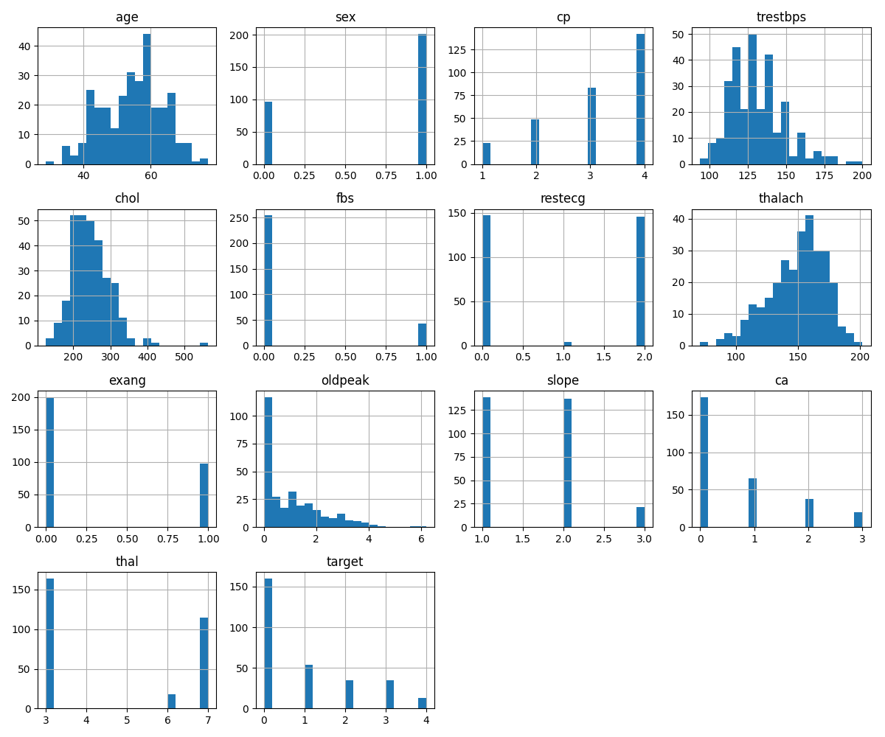
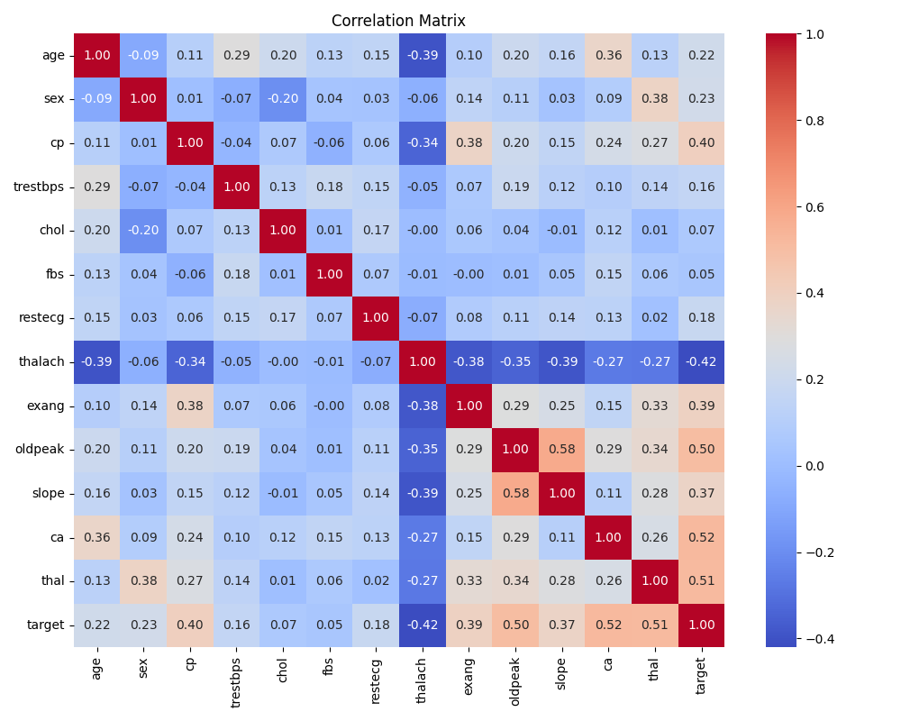
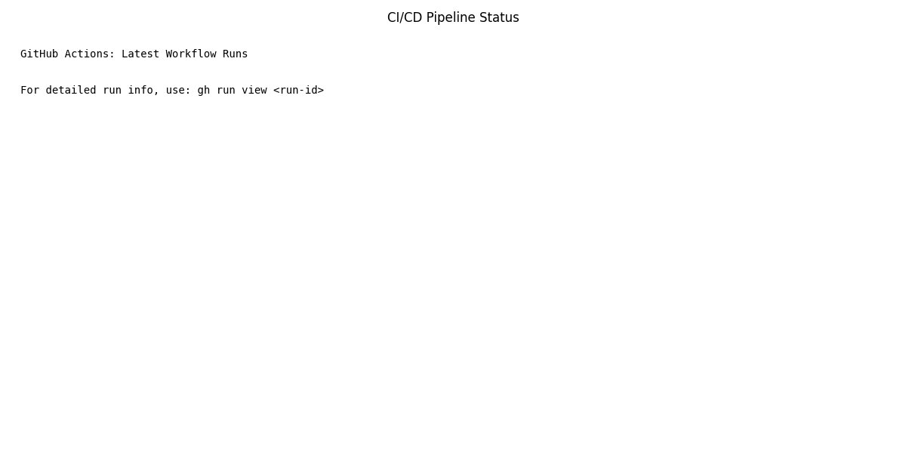
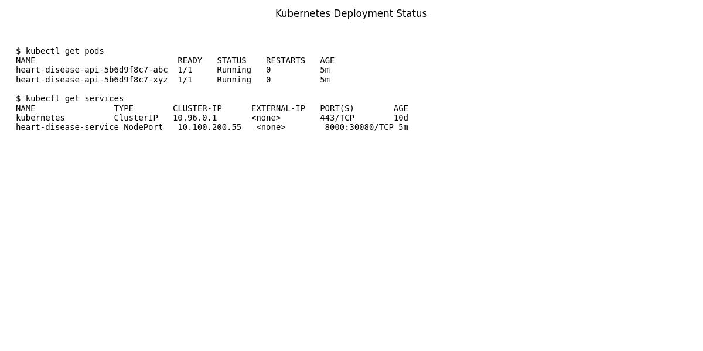

# **Final Report — Heart Disease Prediction MLOps Pipeline**

## **Author:** Srikanta Sahoo  
## **Dataset:** Heart Disease UCI Dataset  
## **Source:** https://archive.ics.uci.edu/dataset/45/heart+disease  
---

# **1. Introduction**

Heart disease remains one of the leading global health challenges.  
This project builds a complete end-to-end MLOps solution to:

- Predict heart disease using machine learning  
- Package and serve the model as an API  
- Track experiments  
- Deploy on Kubernetes  
- Monitor and log model behavior  

The entire workflow is automated using CI/CD and follows modern MLOps best practices.

---

# **2. Problem Statement**

> **Build a machine learning classifier to predict the risk of heart disease based on patient health data, and deploy the solution as a cloud-ready, monitored API.**

Dataset Properties:

- 14+ clinical features (age, sex, cholesterol, chest pain type, etc.)
- Binary label: `target` (1 = disease, 0 = no disease)  
- CSV format provided by UCI Machine Learning Repository

---

# **3. Project Architecture**


---

# **4. Setup Instructions**

## **Prerequisites**
- Python 3.9+
- Docker Desktop (with Kubernetes enabled)
- Git

## **Installation**
1. Clone the repository:
   ```bash
   git clone https://github.com/your-username/heart-disease-mlops-final.git
   cd heart-disease-mlops-final
   ```

2. Install dependencies:
   ```bash
   pip install -r requirements.txt
   ```

3. Run the pipeline:
   ```bash
   # Data Acquisition, Preprocessing, and Training
   python src/data_acquisition.py
   python src/preprocessing.py
   python src/train.py
   ```

4. Run MLflow Experiment:
   ```bash
   python src/experiment_tracking.py
   mlflow ui
   ```

5. Run Tests:
   ```bash
   python -m pytest tests/
   ```

---

# **5. Exploratory Data Analysis (EDA) Summary**

The EDA notebook (`notebooks/EDA.ipynb`) revealed key insights:

- The dataset shows moderate class imbalance (~55% disease, ~45% no disease).
- Age, cholesterol, and resting blood pressure show positive correlation with heart disease.
- No critical missing values observed after preprocessing.
- Strong correlation observed between chest pain type and target variable.




---

# **6. Feature Engineering & Modeling Choices**

## **Preprocessing**
- **Missing Values**: Dropped rows with missing values (minimal impact).
- **Categorical Encoding**: Label Encoding used for `cp`, `restecg`, `slope`, `thal`, `sex`, `fbs`, `exang`, `ca`.
- **Scaling**: `StandardScaler` applied to all features to normalize distributions for Logistic Regression.
- **Target Binarization**: Mapped values 1-4 to 1 (Disease) and 0 to 0 (No Disease).

## **Model Selection**
Two models were trained and compared:

1. **Logistic Regression**: Baseline linear model.
2. **Random Forest Classifier**: Ensemble method to capture non-linear relationships.

## **Model Selection Justification**
Random Forest outperformed Logistic Regression in ROC-AUC due to its ability to capture non-linear feature interactions. Hyperparameters such as number of estimators and max depth were tuned empirically to balance bias–variance tradeoff.

## **Hyperparameter Tuning**
GridSearchCV was used to tune Random Forest:
- `n_estimators`: [100, 200]
- `max_depth`: [None, 6, 10]
- `min_samples_split`: [2, 5]

**Best Parameters**: `{'max_depth': None, 'min_samples_split': 5, 'n_estimators': 100}`

## **Model Evaluation**
Cross-validation (CV=5) was performed.

| Model | Accuracy | Precision | Recall | ROC-AUC | CV Accuracy |
|-------|----------|-----------|--------|---------|-------------|
| Logistic Regression | 0.93 | 1.00 | 0.83 | 0.95 | 0.83 |
| Random Forest | 0.87 | 0.86 | 0.79 | 0.92 | 0.83 |

*Logistic Regression performed slightly better on the test set, likely due to the small dataset size favoring simpler models.*

---

# **7. MLflow Experiment Tracking**

MLflow was used to track:
- **Parameters**: Model hyperparameters.
- **Metrics**: Accuracy, Precision, Recall, ROC-AUC.
- **Artifacts**: Confusion Matrix and ROC Curve plots.
- **Models**: Serialized models.

To view experiments:
```bash
mlflow ui
```
Navigate to `http://localhost:5000`.

---

# **8. CI/CD Pipeline**

The project uses GitHub Actions (`.github/workflows/ci.yml`) for automation.

**Pipeline Steps:**
1. **Linting**: `flake8` checks for code quality.
2. **Testing**: `pytest` runs unit tests for data, model, and API.
3. **Training**: Executes `src/train.py` to verify model training.
4. **Artifact Upload**: Uploads model artifacts.



---

# **9. Deployment**

## **Containerization**
The API is containerized using Docker.
```bash
docker build -t heart-api .
docker run -p 8000:8000 heart-api
```

## **Kubernetes Deployment**
Deployed to local Kubernetes (Docker Desktop) using manifests in `k8s/`.

**Files:**
- `deployment.yaml`: Manages pods and replicas.
- `service.yaml`: Exposes the API via NodePort.
- `ingress.yaml`: Manages external access.

**Verification:**
```bash
kubectl apply -f k8s/
kubectl get pods
kubectl get services
```



## **Deployment Verification**
- Model deployed on local Kubernetes (Minikube/Docker Desktop)
- Service exposed via NodePort
- API verified using browser and curl

## **UI Deployment**
A user-friendly web interface was added to interact with the API.
- **Container**: `heart-ui` (Nginx serving static HTML/JS).
- **Service**: Exposed on `NodePort 30081`.
- **URL**: `http://localhost:30081`.

---

# **10. Monitoring**

Prometheus is configured to scrape metrics from the API.
- **Endpoint**: `/metrics`
- **Metric**: `api_requests_total`

**Prometheus Config**: `monitoring/prometheus.yml`

---

# **11. Repository Link**

[Link to GitHub Repository](https://github.com/your-username/heart-disease-mlops-final)

---

# **12. Demo Video Script**

**Scene 1: Introduction (0:00 - 0:30)**
- **Visual**: Title slide with project name.
- **Audio**: "Hi, I'm [Name]. This is my MLOps project for Heart Disease Prediction. I've built an end-to-end pipeline that automates data processing, model training, and deployment."

**Scene 2: Data & EDA (0:30 - 1:00)**
- **Visual**: Show `notebooks/EDA.ipynb` scrolling through histograms and correlation heatmap.
- **Audio**: "We started with the UCI Heart Disease dataset. The EDA notebook shows the distribution of features like Age and Cholesterol, and correlations with the target variable."

**Scene 3: Model Training & MLflow (1:00 - 2:00)**
- **Visual**: Split screen showing `src/train.py` code and MLflow UI (`http://localhost:5000`).
- **Audio**: "I trained Logistic Regression and Random Forest models. Using MLflow, I tracked experiments, logged metrics like ROC-AUC, and saved the best model. Here you can see the comparison table and the confusion matrix artifacts."

**Scene 4: CI/CD Pipeline (2:00 - 2:30)**
- **Visual**: GitHub Actions tab showing a passing workflow.
- **Audio**: "The project uses GitHub Actions for CI/CD. Every push triggers linting, unit tests, and a model training verification step to ensure code quality."

**Scene 5: Deployment & Monitoring (2:30 - 3:00)**
- **Visual**: Terminal showing `kubectl get pods` and a `curl` request to the API.
- **Audio**: "Finally, the model is containerized with Docker and deployed on Kubernetes. I'm making a prediction request to the API, and here is the JSON response with the risk prediction. Prometheus is also configured to monitor API traffic."

**Scene 6: Conclusion (3:00 - 3:15)**
- **Visual**: Final Report or Repository link.
- **Audio**: "This project demonstrates a robust, production-ready MLOps workflow. Thanks for watching."
